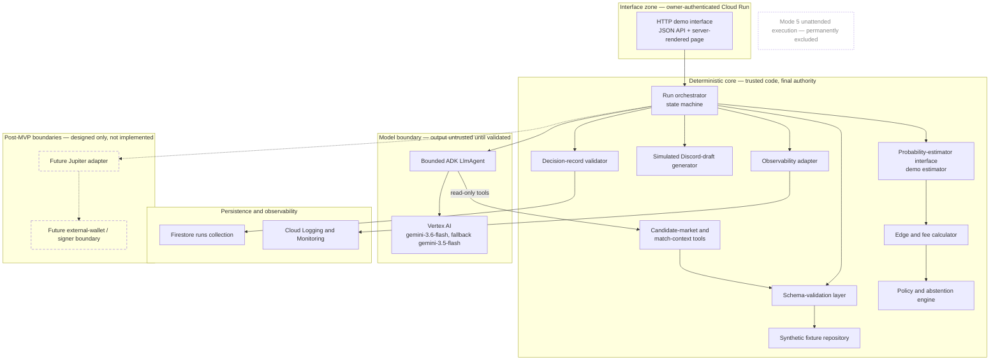
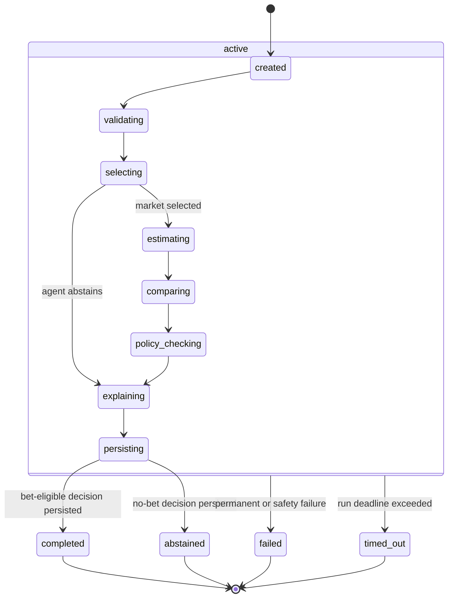
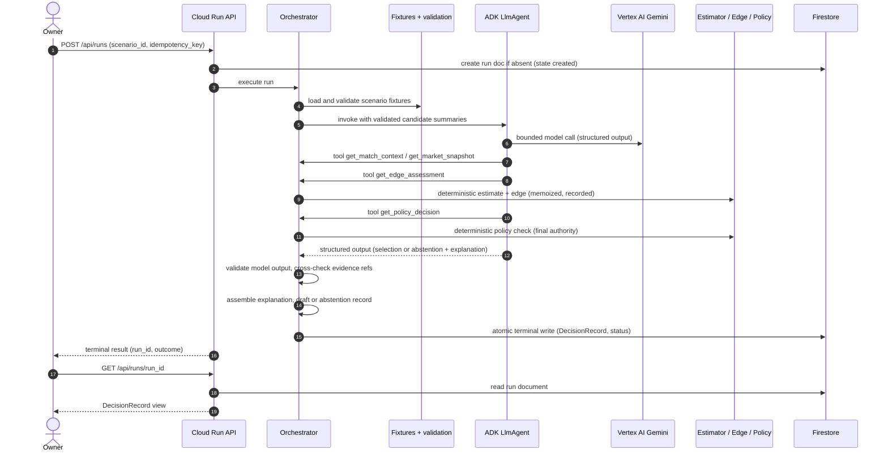
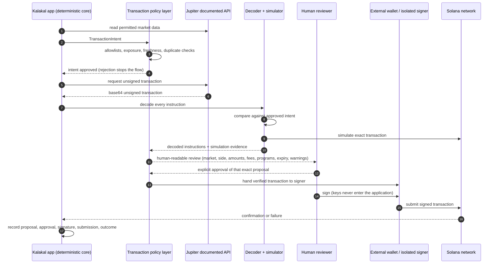
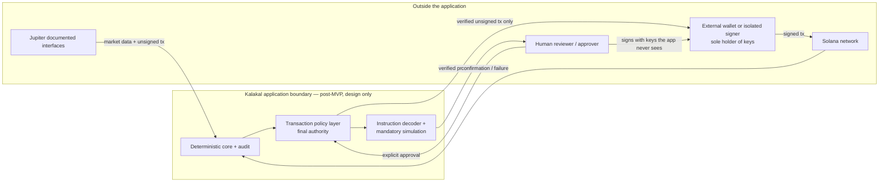

# Kalakal Agent — Architecture (Phase 3)

Design document, written 2026-08-05. This document specifies the architecture of the
Kalakal Agent for the All Things Agentic Hackathon: a fixture-only MVP that is
implemented first, and a post-MVP design (live data, paper/shadow modes, and Mode 4
human-signed transaction proposals) that is specified here but deliberately not
implemented in the first slice.

Governing rules: [CLAUDE.md](../CLAUDE.md). Evidence base:
[research/hackathon.md](research/hackathon.md),
[research/jupiter-prediction-markets.md](research/jupiter-prediction-markets.md),
[research/paybox-security.md](research/paybox-security.md),
[research/jupcallers.md](research/jupcallers.md),
[research/dota2-data-sources.md](research/dota2-data-sources.md),
[research/google-stack.md](research/google-stack.md),
[research/feasibility.md](research/feasibility.md).
The build plan derived from this document is
[implementation-plan.md](implementation-plan.md).

Project scope directives for this phase (user-supplied):

- Agent-prepared transaction proposals are in scope as a post-MVP design target.
- Explicit human review and human signing are in scope for that design.
- Unattended signing and autonomous execution are out of scope. Mode 5 stays disabled.
- Private keys must never reach the application, Gemini, Claude Code, Google Cloud,
  logs, telemetry, browser storage, or this repository.
- The initial MVP is fixture-only. Mode 4 is a post-MVP architectural extension.

Diagram index: component/trust-boundary (§4.1), end-to-end run sequence (§8.2), run
state machine (§7.1), Mode 4 human-signed flow (§11.4), application/Jupiter/policy/
human/wallet boundary (§11.5).

## 1. Scope

### 1.1 Fixture-only MVP definition

The MVP demonstrates one complete agent run over clearly labeled synthetic Dota 2 and
prediction-market data. One run must:

1. Discover candidate synthetic markets from the fixture repository.
2. Select one market or abstain (the bounded ADK agent decides among validated
   candidates; abstention is a first-class outcome).
3. Load validated synthetic match and market context for the selection.
4. Obtain a deterministic probability estimate from a non-LLM estimator interface
   (§10 — a demo estimator, explicitly labeled non-predictive).
5. Compare the estimate with the synthetic market ask price (deterministic edge and
   fee calculation, integer arithmetic only).
6. Apply deterministic policy and abstention rules with final authority outside the
   LLM.
7. Produce a structured, schema-validated explanation.
8. Produce either a clearly labeled `SIMULATION — DO NOT POST` Discord draft or a
   documented no-bet/abstention result.
9. Persist an auditable `DecisionRecord` in Firestore.
10. Display the result through a minimal Cloud Run-hosted interface suitable for the
    unedited hackathon demo.

All fixture data is synthetic and labeled as such: invented team and event names,
invented prices, invented order-book values, invented links on a non-resolvable
domain. No copied Jupiter responses, no real order books, no third-party images, no
real market text, and no data with uncertain redistribution rights.

### 1.2 MVP exclusions (absent, not flag-gated)

The fixture MVP contains **no**:

- Jupiter API calls (no client module exists)
- Live Dota data (no data-source adapters exist)
- Wallet integration or signer code
- Transaction construction, signing, or submission
- Discord API integration (drafts are text rendered in the demo UI only)
- Real-money activity of any kind
- Modes 4 and 5
- PayBox integration
- Automatic scheduling
- Multi-user accounts
- Multi-agent orchestration
- Production prediction-performance claims
- Scraping
- Mobile applications

These are absent from the codebase, not disabled by configuration. There is no flag
whose flip enables any of them; introducing one later requires new modules, new
tests, and the gates in §12–§13.

### 1.3 Post-MVP permitted scope

After the fixture, paper, shadow, policy, simulation, audit, and security milestones
pass (see [implementation-plan.md](implementation-plan.md) slices 12–19 and the
gates in §13), the architecture may introduce:

- Documented official Jupiter data interfaces (§11)
- Permitted Dota data sources
  ([research/dota2-data-sources.md](research/dota2-data-sources.md))
- Paper trading with live data (Mode 2)
- Shadow production (Mode 3)
- Mode 4 human-signed transaction proposals (§11.3–§11.4)
- Copyable Jup Callers drafts for manual posting (CLAUDE.md §8)

### 1.4 Permanently excluded

- **Mode 5 unattended execution** is outside project scope. It is not designed, not
  planned as a later slice, and not represented in any diagram except as an
  explicitly excluded element. No component in this architecture may be extended
  into unattended signing or autonomous submission.
- Reverse-engineering private endpoints, scraping or imitating the Jupiter website,
  circumventing geographic or platform restrictions, and VPN/proxy/routing
  workarounds are permanently excluded (§11.2).

### 1.5 Mode map

| Mode (CLAUDE.md §6) | Status in this architecture |
|---|---|
| 1 Backtest | Post-MVP, after prediction-model gate (§10) |
| 2 Paper trading | Post-MVP (plan slice 14) |
| 3 Shadow production | Post-MVP (plan slice 15) |
| 4 Live transaction proposal (human-signed) | Designed here (§11); implementation gated by §12 |
| 5 Autonomous execution | Permanently excluded |
| Fixture MVP | Implemented first; not a numbered mode — a synthetic-data vertical slice |

"No action" / no-bet is a valid, supported outcome in every mode and in the MVP.

## 2. Selected technology stack

Per [research/google-stack.md](research/google-stack.md) §6 and
[research/feasibility.md](research/feasibility.md) §9:

| Decision | Selection |
|---|---|
| Language | Python (3.10+) |
| Agent framework | Google ADK (`google-adk` 2.x), a single `LlmAgent` |
| Model, primary | `gemini-3.6-flash` via Vertex AI |
| Model, fallback | `gemini-3.5-flash` via Vertex AI (drop-in; use recorded per run) |
| Model auth | Application Default Credentials / Cloud Run service identity — **no Gemini API key exists in the deployment** |
| Compute | Cloud Run, one service, scale-to-zero, `max-instances` capped, authenticated |
| Persistence | Firestore (Native mode), one primary collection `runs` |
| Secrets | Secret Manager **only once a permitted external credential actually exists**; the fixture MVP has none and does not enable it |
| Observability | Cloud Logging + Cloud Monitoring (built-in Cloud Run integration) |

Region policy:

- The fixture-only demo makes no Jupiter calls anywhere in the pipeline, so it may
  use a technically suitable region (us-central1 per the research: Tier 1 pricing,
  co-located Cloud Run + Firestore + regional model endpoint).
- Any environment that accesses live Jupiter data keeps its region **TBD** until the
  region is confirmed compatible with Jupiter's published geographic restrictions
  and with the chosen Gemini model's verified regional availability
  ([research/google-stack.md](research/google-stack.md) §4.5).
- The developer's location is not recorded or inferred anywhere in this repository.
  VPNs, proxies, and routing workarounds are not proposed and are prohibited.

Local development: ADC user credentials against Vertex AI, Firestore emulator, no
key files. The Gemini Developer API free tier is a fixtures-only local fallback and
never part of the deployment.

## 3. Architectural principles

1. **Deterministic core, bounded model.** All probability, price, fee, edge,
   exposure, threshold, freshness, and policy calculations are deterministic
   application code. The LLM selects, synthesizes qualitative context, explains, and
   abstains — nothing else (§4.3).
2. **Policy outside the LLM, with final authority.** The policy and abstention
   engine decides the outcome. Model output is advisory input to orchestration,
   never an override (§4.3, §5).
3. **Validate at every boundary.** External text (even synthetic fixtures, to build
   the habit for live data) is untrusted until it passes the schema-validation
   layer. Model output is untrusted until it passes structured-output validation and
   application cross-checks (§5).
4. **Auditable by construction.** Every run persists sources, timestamps, versions
   (schema, fixture set, prompt, estimator, policy, fee model, model ID), reason
   codes, and outcomes in one `DecisionRecord` (§6, §9).
5. **Integer arithmetic for value.** Prices and money are integer micro-units
   (1,000,000 = $1.00, matching Jupiter's documented convention); probabilities and
   edges are integer parts-per-million. No floating point touches money (§6.1).
6. **UTC everywhere.** All timestamps are UTC, RFC 3339 with `Z` suffix.
7. **Absence over flags.** Excluded capabilities are not present in the code (§1.2).

## 4. Component architecture and trust boundaries

### 4.1 Trust zones and component diagram

Trust zones:

- **Interface zone.** Terminates HTTP. Owner-authenticated (Cloud Run IAM). Performs
  request parsing into `RunRequest` and nothing else.
- **Deterministic core.** Trusted application code. Only code in this zone computes
  numbers, applies policy, composes drafts, and writes to Firestore. Final
  authority for every outcome.
- **Model boundary.** The ADK agent and Vertex AI. Everything crossing back from
  this zone is untrusted data until validated. The agent holds no credentials, no
  write access, and no side-effecting tools.
- **Persistence and observability.** Firestore and Cloud Logging. Written to only by
  the deterministic core, after validation.
- **Post-MVP boundaries.** The Jupiter adapter and the external-wallet/signer
  boundary exist in this document only. The signer boundary is *outside* the
  application: key material never crosses into any zone above (§11.6).

### 4.2 Component responsibilities

| Component | Responsibility | Trust boundary notes |
|---|---|---|
| HTTP/demo interface | `GET /healthz`, `POST /api/runs`, `GET /api/runs/{run_id}`, server-rendered `/` demo page. Parses input, renders validated records. | Owner-authenticated. Never computes; never calls the model or Firestore directly except via orchestrator/repositories. |
| Application run orchestrator | Owns the run state machine (§7), sequences all steps, enforces the run deadline, applies retry policy, assembles the `DecisionRecord`. | Trusted core. The only component that invokes the agent and triggers persistence. |
| Bounded ADK agent | Single `LlmAgent`: selects among validated candidates or abstains; synthesizes qualitative context; produces the structured explanation input. | Model boundary. Read-only tools only; structured output enforced; output validated before use (§5). |
| Synthetic fixture repository | Loads versioned synthetic scenario files shipped with the app; exposes them read-only; carries `fixture_set_version` and content digests. | Trusted storage of untrusted-shaped data: contents still pass validation before use. |
| Schema-validation layer | Validates every fixture document and every model output against explicit typed schemas (§6); rejects incomplete, conflicting, malformed, or stale input with reason codes. | Boundary guard between fixtures/model and the core. Nothing reaches decision logic unvalidated. |
| Candidate-market tools | `list_candidate_markets` — eligible, validated candidate summaries for the agent and UI (eligibility filter of §5.6). | Read-only; serves only validated data. |
| Match-context tools | `get_match_context`, `get_market_snapshot` — validated per-market context. | Read-only; serves only validated data. |
| Probability-estimator interface | Typed interface returning `ProbabilityEstimate`; MVP binding is the deterministic demo estimator (§10), versioned and labeled non-predictive. | Trusted core. Pure function of validated inputs; no LLM involvement. |
| Edge and fee calculator | Deterministic integer arithmetic: gross edge, versioned synthetic fee model, net edge, breakeven. | Trusted core. Pure; reproducible from recorded inputs. |
| Policy and abstention engine | Applies versioned deterministic rules: entry band, minimum net edge, freshness, completeness, duplicate-run checks. Emits `PolicyDecision` with per-check results. | Trusted core; **final authority**. Runs outside the LLM; the LLM cannot override it. |
| Explanation generator | Produces the source-aware `DecisionExplanation` (§6.2.8): assembles the agent's qualitative output when the model ran (`source: "agent"`), or renders a versioned deterministic template (`source: "orchestrator"`) for every no-model path — the pre-selection `NO_VALID_CANDIDATES` abstention and the test-only deterministic-stub selection/abstention paths (§5.10); numbers are rendered from deterministic contracts only, never parsed from prose. | Straddles core/model boundary for agent-sourced narrative (validated, capped, non-authoritative); orchestrator-sourced narrative is deterministic core output. |
| Simulated Discord-draft generator | Deterministic template producing `SimulatedDiscordDraft` with the mandatory `SIMULATION — DO NOT POST` labeling (§6.2.9). Not LLM-generated, so required fields cannot be omitted. | Trusted core. |
| Decision-record validator | Validates the assembled `DecisionRecord` (terminal-shape conformance and shape-conditional completeness per §6.2.10, version fields, reason codes, no forbidden content) before any Firestore write. | Last gate before persistence. |
| Firestore audit repository | Creates the run document, writes progress markers, performs the single atomic terminal write, enforces idempotent creation. | Only the core writes; never the agent (§5.9). |
| Observability adapter | Structured JSON logs with run correlation IDs; emits metric fields (§9.6); applies redaction rules. | Trusted core. |
| Future Jupiter adapter boundary | Post-MVP: typed client over documented official Jupiter interfaces only (§11.1). Absent from the MVP codebase. | Planned; external calls quarantined behind contract-tested schemas. |
| Future external-wallet/signer boundary | Post-MVP: hand-off surface for verified unsigned transactions to an external wallet or isolated signer (§11.6). Absent from the MVP codebase. | Planned; outside the application; no key material ever crosses inward. |

### 4.3 LLM authority boundary

The LLM must never:

- Calculate monetary values, prices, fees, edges, or exposures.
- Invent probabilities, or supply numbers that enter any calculation.
- Override, re-run, or reinterpret the policy engine.
- Approve, construct, sign, or submit a transaction.
- Handle signing material or credentials of any kind.
- Trigger a Firestore write, an external call, or any side effect directly.

The LLM may:

- Select among eligible validated candidate fixtures (§5.6), or abstain.
- Request the bounded read-only tools in §5.1.
- Synthesize qualitative context from validated data.
- Explain validated deterministic calculations in natural language.
- Identify conflicts or missing evidence.
- Abstain, with a reason code, at any point.

Enforcement is structural, not instructional: the agent has no tool that writes, the
policy engine consumes only recorded deterministic inputs, all numeric UI/audit
fields come from deterministic contracts, and orchestration treats the agent's output
as one validated input among several (§5.8).

## 5. Agent boundaries

### 5.1 Exact read-only tools

The `LlmAgent` receives exactly five function tools. All are read-only, idempotent
within a run (results are memoized and recorded), side-effect free, and served from
validated data. Unknown `market_id` values return a typed error object the agent can
observe; they never raise into the model as free text.

| Tool | Input | Output |
|---|---|---|
| `list_candidate_markets` | — | List of eligible, validated `CandidateMarket` summaries for the scenario (§5.6 eligibility filter applied) |
| `get_match_context` | `market_id` | Validated `MatchContext` |
| `get_market_snapshot` | `market_id` | Validated `MarketSnapshot` |
| `get_edge_assessment` | `market_id` | Deterministically computed `ProbabilityEstimate` + `EdgeAssessment` (computed by the application on first call, memoized, recorded) |
| `get_policy_decision` | `market_id` | Deterministically computed `PolicyDecision` over the recorded edge assessment |

`get_edge_assessment` and `get_policy_decision` execute deterministic application
code inside application-owned tool handlers. The agent triggers *when* the numbers
are computed, never *what* they are.

### 5.2 Structured input and output schemas

- **Input**: the agent receives a versioned prompt template (instructions) plus a
  single data block containing the validated candidate summaries and scenario
  metadata, serialized as JSON. No other free text enters the prompt.
- **Output**: a single structured object (ADK `output_schema`, Pydantic-typed):

  - `selected_market_id` (string or null)
  - `abstained` (bool) — exactly one of selection/abstention holds
  - `abstain_reason_code` (enum, required iff `abstained`)
  - `explanation` — qualitative fields only: `summary`, `key_factors[]`
    (factor, direction, `evidence_ref`), `conflicts[]`, `data_gaps[]`,
    `confidence_qualifier` (enum: low/medium/high, qualitative only)
  - `evidence_refs[]` — IDs that must resolve to validated fixture entities

  The schema contains **no numeric monetary or probability fields**. Numbers live
  only in the deterministic contracts.

### 5.3 Bounds, timeouts, retries

Configured centrally and recorded per run. Values are initial defaults sized for
the four-minute demo — a run either completes quickly or fails safely — and may be
adjusted later only on measured evidence:

| Bound | Default |
|---|---|
| Target normal run latency | 30 s or less |
| Max tool calls per run | 8 |
| Max model turns per run | 4 |
| Per-model-call timeout | 15 s |
| Total agent/model budget | 45 s |
| Whole-run deadline | 60 s (hard; the Cloud Run request timeout is set just above it) |
| Repair/retry | At most one repair or one transient retry in total |
| Fallback model | One attempt series on `gemini-3.5-flash`, only if enough of the same 45 s agent/model budget remains |
| Terminal Firestore write retries | 3, exponential backoff, sized to keep the whole run inside the 60 s deadline |

### 5.4 Failure classification

Every failure is classified before handling:

- **Retryable**: transient model/API errors (timeout, 5xx, 429), transient Firestore
  errors. Bounded retries per §5.3, then escalate.
- **Permanent**: unknown scenario, fixture fails schema validation, malformed
  request. No retry; run fails with a `RunFailure` reason code.
- **Safety-critical**: model output fails validation after one repair attempt,
  cross-check mismatch (e.g., selected ID not in candidate set), policy invariant
  breach, attempted out-of-bounds tool call. Never retried; run fails with a
  safety-classified `RunFailure`, and the condition is logged distinctly.

### 5.5 Prompt-injection defenses and untrusted-text separation

Fixture text is synthetic, but it is handled with the same defenses live data will
require, so the pattern is proven before live adapters exist:

1. All text fields pass schema validation (type, length caps, enum membership where
   applicable) before prompt assembly.
2. Instructions come only from versioned prompt templates in the repository. Data
   enters only as a clearly delimited JSON data block; the template states that data
   is content, never instruction.
3. Tool results return validated, typed JSON — never raw upstream text.
4. The agent has no side-effecting tools, so an injected "instruction" has nothing
   to invoke.
5. Model output is schema-validated, and every `evidence_ref` must resolve to a
   validated fixture entity; unresolved references reject the output.
6. Numbers shown to users or persisted for audit come only from deterministic
   contracts; prose never becomes a source of record.
7. Any embedded instruction attempting to alter rules, expose secrets, invoke tools,
   authorize transactions, or change execution mode is inert under 1–6 and is
   additionally a validation-rejection signal when it violates length/shape rules.

### 5.6 Incomplete, conflicting, or stale input → abstention

Two conditions are kept strictly distinct (contract and validators in §6.2.12):

- **Structural invalidity** — malformed types, invalid ranges, unknown fields,
  invalid timestamps, or broken provenance — is a schema-validation failure. The
  run fails with `FIXTURE_INVALID`; a malformed payload is never converted into a
  safe-looking "incomplete" record.
- **Explicitly incomplete or conflicting evidence** — a structurally valid entity
  whose `data_quality` block declares `is_complete: false` with named
  `missing_fields` and/or `conflicts`.

Candidate eligibility (orchestrator-enforced, before any model invocation):

- The schema-validation layer marks each fixture entity complete/incomplete via
  its `data_quality` block (§6.2.12) and fresh/stale (`valid_until` vs. the run's
  evaluation clock).
- The orchestrator evaluates each `status: open` candidate together with its
  required `MatchContext` and `MarketSnapshot`.
- Only candidates whose estimator-consumed evidence is complete and
  non-conflicting — no estimator-consumed field named in `missing_fields`, and no
  conflict whose `field_path` touches an estimator-consumed field — are exposed
  to the agent as selectable candidates.
- Declared conflicts or data gaps on non-estimator evidence leave a candidate
  eligible; the agent sees the declared `data_quality` information, is instructed
  to abstain on conflicting or insufficient evidence, and has a reason-code
  vocabulary for it.
- If no eligible candidate remains, the run terminates before model invocation
  with the orchestrator variant of the pre-selection abstention shape (§6.2.10)
  and reason `NO_VALID_CANDIDATES`. No model call occurs and none is recorded:
  the model-invocation metadata reads `invocation_status: "not_invoked"` and
  carries no model ID, responses, token counts, or tool calls.
- The §5.7 rejection of a selection whose estimator-consumed inputs are missing
  or conflicted remains as defense in depth for contract or tool mismatches;
  normal orchestration filters such candidates out before the agent runs.
- The demo estimator independently refuses input whose estimator-consumed
  fields are missing or conflicted, and never invents replacement values
  (§10.1).
- Independently, the policy engine re-checks completeness and freshness
  (staleness) on the selected market after selection; a failure there yields a
  no-bet `PolicyDecision` (e.g., `POLICY_STALE_DATA`). Abstention is therefore
  enforced twice: advisory at the model, binding at the policy engine.

### 5.7 Rejection of unsupported or malformed model output

Structured-output parsing failure triggers at most one repair attempt (re-prompt
with the validation error; this consumes the single §5.3 repair/retry allowance). A second failure, or any cross-check failure
(selection outside the candidate set, selection of a candidate whose
estimator-consumed inputs are missing or affected by a typed conflict per
§6.2.12 — non-estimator gaps or conflicts do not trigger this rejection, missing
mandatory tool evidence for a selection, contradictory abstain/selection flags),
rejects the output and fails the run with `MODEL_OUTPUT_REJECTED` (safety
classification).
The missing-or-conflicted-input selection cross-check is defense in depth: the
§5.6 eligibility filter removes such candidates before the agent runs, so it can
fire only on a contract or tool mismatch. Rejected output is stored
truncated in the failure record for audit; it is never partially used.

### 5.8 Model responses cannot cause external side effects

- The only components with side effects are application-owned: the Firestore
  repository and the observability adapter.
- Firestore writes are performed by the application after the decision-record
  validator passes — never at the LLM's discretion, never from a tool handler.
- The agent's tools are read-only by construction; ADK tool registration includes
  only the five tools in §5.1.
- The MVP's only external side effects, in total: a bounded Vertex AI model-call
  series, bounded Firestore operations (idempotent run creation, optional
  best-effort progress markers, and one atomic terminal write), and structured
  application logs.

### 5.9 Fallback-model recording

If the fallback model is used, the run records: `fallback_used: true`, the fallback
model ID, the triggering reason (primary error class), and per-model token counts.
The state machine does not branch (§7.5); only metadata and metrics change.

### 5.10 Test-only deterministic selector composition

The deterministic pipeline (plan slice 6) binds the `selecting` step to a
**deterministic test-stub selector** instead of the agent. It exists for two
purposes only: proving the orchestrator, generators, policy engine, and record
assembly end-to-end without a model dependency, and serving as the clearly
labeled emergency-demo path (§8.3). It is test-only, non-predictive, and never
part of the primary demo composition once the agent exists.

**Composition, not configuration.** The agent composition (plan slice 7) and
the deterministic composition are separate, explicit composition roots or
constructors. The stub is never a hidden production flag, a runtime fallback,
or anything that pretends to be the model. Every record is truthful about
which path ran: stub-sourced records carry `abstention_source`/
`selection_source: "deterministic_stub"`,
`invocation_status: "not_invoked"`, an orchestrator-sourced
`DecisionExplanation`, and the `DeterministicSelectorMetadata` block
(§6.2.13) — and no model metadata of any kind (§6.2.10).

**Behavior (deterministic, documented, oracle-free).** The stub:

1. Never reads a scenario's `expected_outcome_class` or
   `expected_reason_code`, and never branches on scenario ID. It operates
   only on the eligible candidate data it is given (the validated candidate
   summaries and their declared `data_quality`).
2. Examines eligible candidates in a documented deterministic order:
   ascending lexicographic `market_id`.
3. Selects the first eligible candidate whose declared evidence is fully
   complete and conflict-free, and uses that candidate's explicit
   evaluation side (fixture-declared and snapshot-validated — never
   inferred from prose).
4. If no such candidate exists, abstains: `CONFLICTING_EVIDENCE` when any
   eligible candidate's evidence declares a (non-estimator) conflict,
   otherwise `INSUFFICIENT_EVIDENCE` for declared (non-estimator) gaps —
   mirroring the abstention instruction the agent receives on the same
   evidence (§5.6).
5. Never sees the zero-eligible case: that remains the orchestrator's §5.6
   short-circuit (`NO_VALID_CANDIDATES`) *before* any selector execution, in
   either composition.
6. Never invents probabilities or numbers. The demo estimator (§10.1)
   remains the only probability source; staleness remains a policy concern —
   stale evidence is not filtered by the estimator-input eligibility filter,
   so the stale-data scenario reaches `policy_checking` and terminates
   `POLICY_STALE_DATA` (§5.6, §7.7) in this composition too.

## 6. Domain contracts

Contracts are documented here and implemented later as typed schemas (plan slice 2).
No implementation classes exist in this phase.

### 6.1 Cross-cutting invariants

- `schema_version` (string) on every contract instance.
- Timestamps: UTC, RFC 3339 with `Z`. Every data-bearing contract carries source
  timestamps (`as_of`) and freshness (`valid_until`) where applicable.
- Money and prices: integer micro-USD, suffix `_micro` (1,000,000 = $1.00 —
  Jupiter's documented native-unit convention). Exact decimal strings are the only
  permitted alternative at display boundaries. No floats.
- Probabilities and edges: integer parts-per-million, suffix `_ppm`
  (0–1,000,000 for probabilities; edges may be negative).
- Fixture provenance on every fixture-derived contract: `fixture_set_id`,
  `fixture_set_version`, `content_digest`, `is_synthetic: true` (invariant: must be
  `true` in the MVP; a validator rejects anything else).
- Version fields recorded per run: `fixture_set_version` and application
  version/revision always; model ID + response metadata and `prompt_version` only
  when a model invocation occurred; the deterministic
  `explanation_template_version` only when an orchestrator-sourced explanation
  was rendered; the deterministic selector's `selector_id`/`selector_version`
  (§6.2.13) only when the test-only deterministic stub selector ran (§5.10);
  `estimator_id`/`estimator_version`, `policy_version`, and
  `fee_model_version` only when the corresponding component ran (terminal shapes,
  §6.2.10). Fields for components that did not run are absent — never fabricated
  and never filled with dummy values.
- `idempotency_key` on the run path (§6.2.1, §9.3).
- Reason codes: closed UPPER_SNAKE enums for abstention and failure.
- Prohibited everywhere: personal information, credentials, wallet key material,
  developer location. The decision-record validator enforces field-level shape; a
  denylist check rejects obvious credential patterns before persistence.

### 6.2 Fixture-MVP contracts

#### 6.2.1 RunRequest

Required: `run_id` (server-derived), `idempotency_key` (client-supplied),
`scenario_id`, `mode` (fixed literal `fixture`), `requested_at`, `schema_version`.
Optional: `evaluation_time` — the immutable UTC **origin** of the run's evaluation
clock (§7.7), for reproducible and intentionally historical fixture runs; defaults
to `requested_at`. Effective evaluation time during the run is derived from this
origin plus monotonic elapsed time, never re-read from the wall clock (§7.7).
Invariants: unknown `scenario_id` is a permanent failure; `mode` values other
than `fixture` are rejected in the MVP; duplicate `idempotency_key` returns the
existing run (§9.3).

#### 6.2.2 CandidateMarket

Required: `market_id`, `event_name` (synthetic), `series_description`, side
semantics (`yes_means`, `no_means`), `status` (open/closed), `market_link`
(synthetic, on a non-resolvable domain), `as_of`, `valid_until`, `data_quality`
(§6.2.12), provenance block.
Invariants: every field above is structurally required — this contract's §6.2.12
allowlist is empty, so nothing may be excused via `missing_fields`; its
`data_quality` block may still record typed `conflicts` (a conflict can exist
even when every field is present); only `status: open` candidates that pass the
§5.6 eligibility filter reach the agent; link domain must be the designated
synthetic domain; `is_synthetic` true.

#### 6.2.3 MatchContext

Structurally required (never excusable via `missing_fields`): `match_id`,
`market_id` ref, team names (synthetic), `best_of`, tournament name/tier
(synthetic), roster entries, patch label, `scheduled_start`, `as_of`,
`valid_until`, `data_quality` (§6.2.12), provenance.
Conditionally optional — this contract's §6.2.12 allowlist, which is exactly the
estimator-consumed evidence fields: the synthetic team rating inputs and the
recent-form summary. Each may be absent or null only when named in
`missing_fields`, which forces `is_complete: false`; in the Pydantic
representation these fields — and only these — are conditionally optional.
Invariants: malformed values are structural validation failures
(`FIXTURE_INVALID`), never represented as incompleteness; freshness is
policy-checked against the run's evaluation clock (§5.6).

#### 6.2.4 MarketSnapshot

Structurally required (never excusable via `missing_fields`): `market_id`,
`side`, `ask_price_micro`, `captured_at`, `valid_until`, `fee_model_version` ref,
`data_quality` (§6.2.12), provenance — a snapshot without an ask price is
structurally invalid, not incomplete.
Conditionally optional — this contract's §6.2.12 allowlist: `bid_price_micro`
and `liquidity_hint_micro`. Each may be null/absent only when named in
`missing_fields`, which forces `is_complete: false`; otherwise both must be
present.
Invariants: `0 < ask_price_micro < 1_000_000`; snapshot staleness is
policy-checked against the evaluation clock at decision time, not load time.

#### 6.2.5 ProbabilityEstimate

Required: `market_id`, `side`, `probability_ppm`, `estimator_id`,
`estimator_version`, `is_predictive` (invariant: `false` in the MVP),
`display_label` (invariant: exactly `DEMO ESTIMATOR — NOT PREDICTIVE` while
`is_predictive` is false), `inputs_digest`, `computed_at`, basis fields (the exact
deterministic inputs used). Invariants: recomputable bit-for-bit from recorded
inputs; produced only by the estimator interface, never by the LLM.

#### 6.2.6 EdgeAssessment

Required: `market_id`, `side`, `probability_ppm`, `ask_price_micro`,
`gross_edge_ppm`, `fee_estimate_micro`, `fee_rate_ppm`, `fee_model_version`,
`net_edge_ppm`, `computed_at`, input digests.

**Fee semantics.** `fee_estimate_micro` means: the estimated synthetic fee per one
contract whose successful payout is $1.00, expressed in micro-USD. Because a
probability in ppm and a per-$1-contract micro-USD amount both use a 1,000,000
scale, the two are numerically comparable for per-contract expected-value
calculations — which is what makes the edge arithmetic below well-typed.

**Synthetic fee configuration.** The fixture MVP's fee model is versioned fixture
configuration consisting of `fee_rate_ppm` (a proportional rate applied to the ask
price) and `fee_model_version`, clearly labeled synthetic/non-production. This is
a fixture-demo fee model, not Jupiter's real fee formula (the real formula is
unpublished — see
[research/jupiter-prediction-markets.md](research/jupiter-prediction-markets.md) §6).

**Arithmetic (integer-only; conservative ceiling division for the fee, so the net
edge is never overstated):**

- `fee_estimate_micro = ceil(ask_price_micro × fee_rate_ppm / 1_000_000)`
- `gross_edge_ppm = probability_ppm - ask_price_micro`
- `net_edge_ppm = gross_edge_ppm - fee_estimate_micro`

**Validation:** `0 <= fee_rate_ppm <= 1_000_000`;
`0 <= fee_estimate_micro <= 1_000_000`; every input and result is an integer, with
no float conversion anywhere in the calculation; negative `gross_edge_ppm` and
`net_edge_ppm` are valid values, not errors; out-of-range financial inputs are
rejected, never clamped.

**Worked synthetic example** (the documented reference case for tests):

| Quantity | Value |
|---|---|
| `probability_ppm` | `650_000` |
| `ask_price_micro` | `600_000` |
| `fee_rate_ppm` (synthetic, 1%) | `10_000` |
| `fee_estimate_micro` = ceil(600_000 × 10_000 / 1_000_000) | `6_000` |
| `gross_edge_ppm` = 650_000 − 600_000 | `50_000` |
| `net_edge_ppm` = 50_000 − 6_000 | `44_000` |

Invariants: integer arithmetic only; reproducible bit-for-bit from recorded
inputs; the synthetic fee model is versioned fixture configuration, clearly
labeled synthetic.

#### 6.2.7 PolicyDecision

Required: `decision` (`proceed` | `no_bet`), `reason_codes[]`, `checks[]` (each:
`check_id`, `passed`, observed value, threshold, threshold source), `policy_version`,
configured-rule provenance (e.g., the Jup Callers entry band 100,000–900,000 micro
as externally sourced configuration per CLAUDE.md §8), `evaluated_at`, input
digests. `evaluated_at` records the run's **effective evaluation time at the
moment policy checking begins** (§7.7) — the freshness checks read `valid_until`
against exactly this value. Invariants: derived solely from recorded
deterministic inputs; the engine
is a pure function; the checks independently re-verify completeness (§6.2.12) and
freshness of the selected market's evidence after selection, trusting no upstream
stage; `no_bet` is a successful outcome, not an error.

#### 6.2.8 DecisionExplanation

The run's narrative explanation, source-aware so the record never implies a model
produced text when none ran. Required for both sources: `run_id`, `source`
(`agent` | `orchestrator`), `summary` (bounded length), `key_factors[]`,
`conflicts[]`, `data_gaps[]`, `confidence_qualifier` (qualitative enum),
`evidence_refs[]` (must resolve).

Conditional fields (validator-enforced in both directions):

- `source: "agent"` — `prompt_version` required; model metadata ref required;
  `explanation_template_version` must be absent.
- `source: "orchestrator"` — `explanation_template_version` (the versioned
  deterministic template used, required for audit reproducibility);
  `prompt_version` must be absent; model metadata ref must be absent.

Invariants: both variants are narrative-only and non-authoritative; they contain
no authoritative numbers — the UI and audit record render all displayed or
persisted numeric claims from §6.2.5–§6.2.7; prose is validated for schema and
length, and stored as narrative only.

#### 6.2.9 SimulatedDiscordDraft

Required: `draft_text` plus structured duplicates of every mandatory element:
leading label `SIMULATION — DO NOT POST`, exact synthetic event + market side,
synthetic market link (non-resolvable domain), current synthetic ask price, model
confidence (from the deterministic estimate, labeled non-predictive), estimated
edge, `#nfa`, `generated_at`, `expires_at` + stale-regeneration warning,
`is_simulation` (invariant: `true`). Invariants: exactly one draft per
(run, market, side); generated deterministically from validated contracts so no
mandatory element can be omitted; the synthetic link intentionally does not use the
real `jup.ag` domain so a simulated draft can never masquerade as a postable call
(the real-draft rules of CLAUDE.md §8, including the exact `jup.ag` link, bind the
post-MVP draft generator, not this simulation).

#### 6.2.10 DecisionRecord

The audit aggregate, persisted once per run. A `DecisionRecord` is conditional by
outcome path: it exists in exactly three valid terminal shapes, and model-level
validators reject every inconsistent combination before persistence. Failures and
timeouts persist a `RunFailure` (§6.2.11) instead — never a partial
`DecisionRecord`.

Common to all three shapes: `run_id`, `schema_version`, the `RunRequest`, fixture
provenance, candidates considered (with their §5.6 eligibility results), the
run's validated selection/abstention output, `DecisionExplanation` (§6.2.8),
model-invocation metadata (below), all audit/version fields (§6.1),
state-transition history with timestamps, latency, reason codes, terminal
`outcome` (`completed` | `abstained`).

**Model-invocation metadata.** Every record carries `invocation_status`
(`invoked` | `not_invoked`). When `invoked`: model ID, `prompt_version`, response
IDs, token counts, fallback data per §5.9, and the model tool-call log are
required. When `not_invoked`: all of those fields must be absent — never
fabricated and never represented with dummy values. The record must never imply
that Gemini produced an explanation, response, tokens, or tool calls when no
model invocation occurred.

**Shape A — pre-selection abstention** (`outcome: abstained`). No market was
selected and every post-selection artifact is absent. One terminal field shape
with exactly three source variants, discriminated by `abstention_source`:

- **Agent variant** (`abstention_source: "agent"`): the agent abstained in
  `selecting`. Required: the validated agent abstention output
  (`abstained: true`, `selected_market_id: null`) with its agent
  `abstain_reason_code` (never `NO_VALID_CANDIDATES`); at least one eligible
  candidate; an agent-produced `DecisionExplanation`
  (`source: "agent"`); and `invocation_status: "invoked"` with model ID,
  response metadata, token usage, `prompt_version`, and the applicable
  tool-call records. `DeterministicSelectorMetadata` must be absent.
- **Orchestrator variant** (`abstention_source: "orchestrator"`): used only by
  the deterministic `NO_VALID_CANDIDATES` short-circuit (§5.6). Required: a
  deterministic abstention output whose reason code is `NO_VALID_CANDIDATES`;
  zero eligible candidates; an orchestrator-produced `DecisionExplanation`
  (`source: "orchestrator"`)
  carrying its deterministic `explanation_template_version` for audit
  reproducibility; and `invocation_status: "not_invoked"`. Model ID, response
  IDs, token usage, `prompt_version`, fallback-model data, and model tool-call
  records must be absent — not fabricated and not represented with dummy
  values. `DeterministicSelectorMetadata` must also be absent: this variant
  fires before any selector runs.
- **Deterministic-stub variant** (`abstention_source: "deterministic_stub"`):
  the test-only deterministic selector (§5.10) abstained in `selecting`.
  Required: at least one eligible candidate; a deterministic abstention
  output whose reason code is **not** `NO_VALID_CANDIDATES` (that reason
  stays orchestrator-only); an orchestrator-produced `DecisionExplanation`
  (`source: "orchestrator"`) with its deterministic
  `explanation_template_version`; `invocation_status: "not_invoked"`; and
  the `DeterministicSelectorMetadata` block (§6.2.13). Model ID, response
  IDs, token usage, `prompt_version`, fallback-model data, and model
  tool-call records must be absent — not fabricated and not represented
  with dummy values.

All variants: selected market, `MatchContext`, `MarketSnapshot`,
`ProbabilityEstimate`, `EdgeAssessment`, `PolicyDecision`, and
`SimulatedDiscordDraft` must be absent.

**Shape B — policy no-bet after selection** (`outcome: abstained`). Required:
selected market, `MatchContext` refs with timestamps, `MarketSnapshot`,
`ProbabilityEstimate`, `EdgeAssessment`, `PolicyDecision` with
`decision: "no_bet"`, explanation, and full audit/version metadata. Must be
absent: `SimulatedDiscordDraft`.

**Shape C — completed proceed decision** (`outcome: completed`). Required:
selected market, `MatchContext` refs with timestamps, `MarketSnapshot`,
`ProbabilityEstimate`, `EdgeAssessment`, `PolicyDecision` with
`decision: "proceed"`, explanation, `SimulatedDiscordDraft`, and full
audit/version metadata.

**Selection-source attribution on shapes B and C.** Both post-selection shapes
carry `selection_source` (`"agent"` | `"deterministic_stub"`), owned by the
application/record layer — the model-produced selection output itself carries
no source field, so a model can never claim its own trust source. The two
truthful variants of each shape:

- `selection_source: "agent"` — requires `invocation_status: "invoked"` with
  full model metadata and an agent-sourced `DecisionExplanation`;
  `DeterministicSelectorMetadata` must be absent.
- `selection_source: "deterministic_stub"` (test-only composition, §5.10) —
  requires `invocation_status: "not_invoked"`, an orchestrator-sourced
  `DecisionExplanation` with its deterministic
  `explanation_template_version`, and the `DeterministicSelectorMetadata`
  block (§6.2.13). Model ID, `prompt_version`, response IDs, token usage,
  fallback data, and model tool-call records must be absent.

Model-level validators reject every inconsistent combination, including at least:
`outcome: completed` without a draft, or with a `no_bet` (or absent)
`PolicyDecision`; a draft present with `outcome: abstained` or
`decision: "no_bet"`; any post-selection artifact (`MatchContext`,
`MarketSnapshot`, `ProbabilityEstimate`, `EdgeAssessment`, `PolicyDecision`,
draft) present on shape A in any variant; a selected market without a
`PolicyDecision`; a `PolicyDecision` without both `ProbabilityEstimate` and
`EdgeAssessment`; an abstention output that also names a selected market;
`abstention_source: "orchestrator"` with any model ID, `prompt_version`,
response metadata, token usage, or model tool-call records;
`abstention_source: "orchestrator"` with a reason code other than
`NO_VALID_CANDIDATES`; `abstention_source: "agent"` with
`invocation_status: "not_invoked"`; `abstention_source: "agent"` without the
required model metadata; shape B or C with `selection_source: "agent"` and
`invocation_status: "not_invoked"`; any `"deterministic_stub"`-sourced record
with `invocation_status: "invoked"` or any model metadata; a
`"deterministic_stub"` source without `DeterministicSelectorMetadata`;
`DeterministicSelectorMetadata` present with any non-stub source;
`abstention_source: "deterministic_stub"` with reason `NO_VALID_CANDIDATES`
or with zero eligible candidates; and a `DecisionExplanation` whose `source`
contradicts the record's source attribution or invocation status.

Invariants: immutable after the terminal write (§9.7); passes the decision-record
validator before any write; no PII, credentials, or key material.

#### 6.2.11 RunFailure

Required: `run_id`, `state_at_failure`, `classification`
(retryable/permanent/safety), `reason_code` (e.g., `SCENARIO_UNKNOWN`,
`FIXTURE_INVALID`, `MODEL_UNAVAILABLE`, `MODEL_OUTPUT_REJECTED`,
`PERSISTENCE_ERROR`, `INTERNAL_ERROR`), redaction-safe `message`, `occurred_at`,
model metadata when relevant, truncated rejected output when relevant (§5.7).
Invariants: written on `failed`/`timed_out` terminals; never contains raw
credentials or unbounded payloads.

#### 6.2.12 DataQuality

A small reusable data-quality block embedded in every evidence-bearing
fixture-derived contract (`CandidateMarket` §6.2.2, `MatchContext` §6.2.3,
`MarketSnapshot` §6.2.4) as `data_quality`:

- `is_complete` (bool)
- `missing_fields[]` (field paths of allowlisted evidence fields whose values
  are genuinely unavailable)
- `conflicts[]` (typed conflict entries, defined below)

**Structural floor vs. allowlisted evidence.** Identity, linkage, provenance,
schema/version, and the relevant timestamps of every embedding contract are
structurally required and can never be excused through `missing_fields`. Only an
explicitly documented allowlist of evidence fields per contract (declared in
§6.2.2–§6.2.4) may be absent or null. In the Pydantic representation those
allowlisted fields — and only those — are conditionally optional; every other
field remains unconditionally required, so "required" never contradicts "may be
absent".

Validator-enforced invariants:

- Every absent or null allowlisted field appears exactly once in
  `missing_fields`.
- Every path in `missing_fields` identifies a known allowlisted field of the
  embedding contract that is actually absent or null. Unknown paths, duplicate
  paths, and attempts to mark structural fields as missing are validation
  failures.
- `is_complete: true` requires empty `missing_fields`, empty `conflicts`, and
  every conditionally optional estimator-consumed input present.
- `is_complete: false` requires at least one genuinely missing allowlisted
  field or at least one conflict.
- A conflict may exist even when the field it concerns is present.

**Conflict structure.** Each entry in `conflicts[]` is typed, bounded, and
audit-safe — never untyped prose and never an arbitrary unbounded payload:

- `field_path` — the affected field, which may itself be present; unknown paths
  are validation failures
- `description` — bounded length
- `evidence_refs[]` — non-empty; each ref must resolve to a validated fixture
  entity or recorded source

Boundary rule — structural invalidity is not incompleteness. Malformed types,
invalid ranges, unknown fields, invalid timestamps, and broken provenance are
structural validation failures that fail the run with `FIXTURE_INVALID`
(§6.2.11). The `data_quality` block only lets *structurally valid* data
explicitly represent unavailable or conflicting evidence. Arbitrary malformed
payloads must never be turned into safe-looking incomplete records.

Consequences elsewhere in the design: the demo estimator refuses input whose
estimator-consumed fields are missing or conflicted — while accepting entities
whose `is_complete: false` stems only from non-estimator evidence — and never
invents replacement values (§10.1); the orchestrator exposes only eligible
candidates to the agent and terminates with the orchestrator-variant
pre-selection abstention (`NO_VALID_CANDIDATES`) when none remain (§5.6); and
the policy engine independently re-checks completeness and freshness after
selection (§6.2.7).

#### 6.2.13 DeterministicSelectorMetadata

The strict, frozen identity block of the test-only deterministic selector
(§5.10), carried by every `deterministic_stub`-sourced record:

- `selector_id` — identifies the deterministic Slice 6 stub unambiguously
- `selector_version` — the stub is versioned like every other recorded
  component
- `test_only` (invariant: literal `true`) — structurally marks the selector
  as test-only/non-model

Invariants: required exactly when a record's `abstention_source` or
`selection_source` is `"deterministic_stub"`, and forbidden on every other
source (§6.2.10); structurally non-model — no model ID, `prompt_version`,
response IDs, token counts, fallback information, or tool-call fields exist
on this contract, so a deterministic run can never be dressed up as a model
invocation.

### 6.3 Post-MVP contracts (documented only — not implemented in the MVP)

These exist so the Mode 4 design (§11) has stable vocabulary. They must not be
implemented before the §12.1 development-entry criteria hold; any live use
additionally requires §12.2.

- **TransactionIntent** — the structured, policy-checkable statement of what the
  agent proposes: `intent_id`, source `run_id`/decision ref, `market_id`, side,
  `max_amount_micro`, `limit_price_micro`, expected contracts, deposit mint,
  `expires_at`, `policy_version`, `idempotency_key`, `created_at`. Invariants:
  produced by deterministic code from a `proceed` decision; every field bounded by
  policy configuration; immutable once policy-approved — any change is a new intent.
- **UnsignedTransactionProposal** — `proposal_id`, `intent_id` ref, the
  Jupiter-returned base64 unsigned transaction, transaction digest,
  `decoded_instructions[]`, `simulation_result` ref, `expires_at`, status
  (`pending_review` | `approved` | `invalidated` | `expired` | `rejected`).
  Invariants: never signed inside the application; digest binds review, approval,
  and hand-off to one exact byte sequence; any mutation invalidates it.
- **DecodedInstruction** — per Solana instruction: `program_id`, ordered accounts
  (pubkey, signer/writable flags), parsed amounts/mints/destinations where
  decodable, raw data digest, `matches_intent` verdict per comparison rule, and the
  rule ID applied. Invariant: **every** instruction must be decoded and compared;
  any undecodable or unexpected element fails the proposal (§11.3 step 8).
- **SimulationResult** — `simulated_at`, success flag, compute units, balance
  changes by account/mint, program logs digest, slippage estimate, error detail on
  failure. Invariant: simulation of the exact final transaction is mandatory before
  human review; a failed or missing simulation blocks the proposal.
- **HumanApproval** — `approval_id`, `proposal_id` + transaction digest it approves,
  the human-readable review content shown (§11.3 step 10), `approved_at`,
  `expires_at`, approver acknowledgment. Invariants: explicit per-proposal approval;
  single-use; bound to the exact digest — any change after approval invalidates it
  and requires a new review; expiry is short and enforced.
- **SignedSubmissionResult** — `submission_id`, `proposal_id`, on-chain signature,
  `submitted_at`, confirmation status, final order status from documented
  status-polling, failure detail. Invariants: signing happened outside the
  application (§11.6); the application records results and public identifiers only —
  never key material.

## 7. Run state machine

### 7.1 States and transitions

| State | Work performed |
|---|---|
| `created` | Run document created (idempotent, §9.3); request accepted. |
| `validating` | Scenario fixtures loaded and schema-validated; freshness pre-check; candidate-eligibility filter applied (§5.6); abort to `failed` on `FIXTURE_INVALID`/`SCENARIO_UNKNOWN`; short-circuit to `explaining` with the orchestrator-variant pre-selection abstention (`NO_VALID_CANDIDATES`, no model invocation) when no eligible candidate exists. |
| `selecting` | Bounded selector invocation — the agent (§5) in the primary composition, or the test-only deterministic stub selector (§5.10) in the deterministic composition; outcome is a validated selection or abstention. |
| `estimating` | Deterministic estimator produces `ProbabilityEstimate` (memoized if already computed via tool call). |
| `comparing` | Edge and fee calculator produces `EdgeAssessment`. |
| `policy_checking` | Policy engine produces `PolicyDecision` (final authority; re-checks freshness against the evaluation clock). |
| `explaining` | Explanation assembled and validated; on `proceed`, the simulated draft is generated deterministically. |
| `persisting` | Decision-record validator runs; single atomic terminal Firestore write. |
| Terminals | `completed` (proceed decision, draft present — shape C of §6.2.10), `abstained` (pre-selection abstention or policy no-bet — shapes A/B of §6.2.10; a successful outcome), `failed`, `timed_out` (both failure terminals persist a `RunFailure`). |

Allowed transitions are exactly those in the diagram: strictly forward, no re-entry
into earlier states, no transition out of a terminal state. `abstained` is a
first-class success: it flows through `explaining` and `persisting` like any other
run and produces a `DecisionRecord` in the terminal shape matching its path
(§6.2.10) — the pre-selection abstention shape (A) with
`abstention_source: "agent"` when the agent abstains in `selecting`
(`"deterministic_stub"` when the test-only stub selector of §5.10 abstains
there instead), the same
shape with `abstention_source: "orchestrator"` and
`invocation_status: "not_invoked"` when the eligibility filter leaves no
candidates in `validating` (`NO_VALID_CANDIDATES`), and the policy no-bet shape
(B) when the policy engine returns `no_bet` after selection. A `proceed`
decision persists the completed shape (C) with its simulated draft. Shapes B
and C carry the record-layer `selection_source` attribution (`"agent"` or
`"deterministic_stub"`) for the selector composition that ran. `failed` and
`timed_out` persist a `RunFailure` (§6.2.11), never a partial `DecisionRecord`.

### 7.2 Idempotency

- `POST /api/runs` with a previously seen `idempotency_key` returns the existing
  run's state without re-executing anything (§9.3).
- Deterministic steps are memoized within a run; a tool call and the orchestrator's
  own pass over the same market produce one recorded computation, not two.
- The terminal write is idempotent: its content is deterministic for the run, and
  the transaction precondition (§9.2) makes double-finalization impossible.

### 7.3 Retry boundaries

Retries live *inside* steps (a model call, a Firestore write), never across states.
A state either completes and transitions forward, or the run moves to a terminal.
There is no resume-after-terminal and no replay of a partially executed run; a new
attempt is a new run with a new `idempotency_key`.

### 7.4 Timeout handling

A single hard run deadline (default 60 s; target normal latency 30 s or less) is
checked at every transition and enforced around the agent step and model calls. On
expiry the run transitions to `timed_out` and a best-effort `RunFailure` terminal
write is attempted with the same bounded retry policy as §7.6, whose backoff is
sized to stay inside the whole-run deadline. The demo must fail safely and
promptly rather than wait for several minutes.

### 7.5 Fallback-model behavior

Fallback use does not change the state graph. The run remains in `selecting` (or
`explaining` if the failure occurs there), the fallback attempt series runs only if
enough of the same 45 s agent/model budget remains — and shares it — and the
outcome is recorded per §5.9. If the fallback also fails,
the run transitions to `failed` with `MODEL_UNAVAILABLE` (retryable class — the
caller may start a new run).

### 7.6 Recovery after a Firestore write failure

Terminal write fails after 3 backoff attempts (backoff sized to stay inside the
60 s whole-run deadline) → the run is reported to the caller as
`failed` / `PERSISTENCE_ERROR`, and the complete validated record is emitted to
structured logs (redaction-safe, correlation-ID-tagged) so the audit trail survives.
Reconciliation is documented in §9.8. Progress-marker write failures (non-terminal)
are logged and ignored — they are best-effort observability, not audit.

### 7.7 The evaluation clock, and input becoming stale during execution

The run's evaluation clock reconciles two requirements that a single frozen
timestamp cannot: reproducible (possibly historical) evaluation origins, and
freshness that can genuinely expire while a run executes.

- `RunRequest.evaluation_time` (§6.2.1) is the **immutable UTC origin** of the
  run's evaluation clock. When omitted it defaults to `requested_at`.
- At run start, the orchestrator captures a monotonic start value. At each
  step, the **effective evaluation time** is derived as
  `request.evaluation_time + monotonic elapsed duration since run start`.
  No wall-clock lookup occurs after run start.
- The hard 60 s run deadline (§5.3, §7.4) is measured in the same monotonic
  elapsed time.
- `policy_checking` receives the effective evaluation time at the moment
  policy checking begins, and `PolicyDecision.evaluated_at` records exactly
  that value (§6.2.7).
- Operational transition timestamps (§6.2.10 state history) may similarly be
  derived as `requested_at + monotonic elapsed`, keeping operational time
  distinct from an intentionally historical fixture evaluation origin.
- Tests inject a fake clock, making elapsed time deterministic: a
  short-lived synthetic input can become stale before `policy_checking`
  while the run stays inside the 60 s deadline, and a zero-advance fake
  clock evaluates every step at exactly the supplied `evaluation_time` —
  which keeps the shipped fixture outcomes reproducible.

Freshness is therefore evaluated against the effective evaluation time at
`policy_checking`, not only at load time. If an input's `valid_until` passes
mid-run (e.g., during a slow
agent step), the policy engine returns `no_bet` with `POLICY_STALE_DATA` and the run
terminates as `abstained` — a correct, auditable outcome rather than a failure.

## 8. Minimal interface and demo flow

### 8.1 Interface

| Route | Behavior |
|---|---|
| `GET /healthz` | Liveness: returns status and revision; no model or Firestore call. |
| `POST /api/runs` | Body: `scenario_id`, `idempotency_key`. Executes the run synchronously within the request (bounded by the §5.3 deadline) and returns the terminal result. Duplicate keys return the existing run. |
| `GET /api/runs/{run_id}` | Returns the persisted run view (status, `DecisionRecord` or `RunFailure`). |
| `GET /` | Minimal server-rendered demo page: choose one of the synthetic scenarios, trigger a run, view results, list recent runs. |

The demo page displays, for each run, the fields present in its terminal shape
(§6.2.10): selected market or abstention; fixture and
evidence timestamps; the deterministic probability (with the `DEMO ESTIMATOR — NOT
PREDICTIVE` label); the synthetic ask price; the edge calculation; the policy result
with per-check outcomes; the decision explanation with its labeled source (agent
or orchestrator); the `SIMULATION — DO NOT POST`
Discord draft when applicable; the audit/run ID; and persistent fixture-data and
paper-mode labels on every screen.

Recommended synthetic scenarios (final set fixed in plan slice 3): clear-edge
(produces a draft), thin-edge (policy no-bet), conflicting-evidence (qualitative
conflicts on non-estimator evidence — candidates stay eligible and the agent
abstains), stale-data (freshness no-bet), outside-entry-band (policy no-bet),
no-valid-candidates (every candidate's estimator-consumed evidence incomplete or
conflicting — the orchestrator abstains before model invocation).

**Authentication and cost abuse.** The Cloud Run service requires IAM
authentication; only the owner holds `roles/run.invoker`. Cost-abuse controls:
authenticated endpoint (no drive-by requests), `max-instances` 1–2, the Cloud Run
request timeout set just above the 60 s run deadline, at most one bounded
model-call series per run, spend-cap
budgets as backstop ([research/google-stack.md](research/google-stack.md) §4.4). For
browser access to an IAM-protected service the owner uses `gcloud run services
proxy` (or an identity-token header); if rehearsal shows this weakens the demo, a
narrowly scoped alternative — temporarily allowing unauthenticated access during the
recording window only, with `max-instances=1`, then revoking immediately — is the
documented fallback. A permanently public demo endpoint is justified only later, if
ever, with rate limiting and its own review.

### 8.2 End-to-end run sequence

### 8.3 Unedited four-minute demo sequence

Before recording: deploy, health-check, and warm the service (one real request), or
temporarily set `--min-instances 1` for the recording window. The on-camera
execution remains live and unedited with a warm backend. Restore scale-to-zero
afterwards. The §5.3 budgets protect the take: a healthy run targets 30 s or less,
and a stalled dependency fails safely inside the 60 s hard deadline instead of
hanging the recording.

1. Show the Cloud Run service and revision in the console (region, `*.run.app` URL).
2. Show the service is healthy (`GET /healthz`).
3. Trigger one fixture run from the demo page (visible fixture/paper labels).
4. Show the agent's structured result: selection or abstention, deterministic
   numbers, policy checks, explanation, and the simulated draft or no-bet record.
5. Show the corresponding Cloud Logging entries (request log + structured run logs).
6. Show the Firestore audit document for the run ID just produced.
7. Show the `run.app` service URL.

Contingency: if Vertex AI is temporarily unavailable at recording time, the fallback
ladder is primary model → fallback model → graceful, auditable failure. Keep one
previously completed fixture run available to walk through, and keep the
deterministic no-LLM pipeline composition (plan slice 6, §5.10) available as a
clearly labeled
emergency demonstration of the deterministic core.

## 9. Firestore and observability

### 9.1 Structure

One primary collection:

- `runs/{run_id}` — the whole run: `status`, `created_at`, `updated_at`, request,
  bounded `transitions[]` array (state, timestamp), and on terminal either
  `decision_record` or `failure`. No subcollections in the MVP: a run's audit data
  is one bounded document (well under Firestore's 1 MiB limit), and a single-user
  agent produces tens of runs per day. Subcollections are added only if a future
  mode genuinely needs unbounded per-run history.

### 9.2 Append/audit semantics and atomic completion

- The run document is created once (`created`), receives best-effort progress-marker
  updates (`status`, `transitions[]` append), and is finalized by a **single
  transaction** that writes `decision_record` (or `failure`), the terminal `status`,
  and `completed_at` together, with a precondition that the current status is
  non-terminal. Audit data is therefore atomic: either the validated record — a
  `DecisionRecord` in one of the three terminal shapes of §6.2.10, or a
  `RunFailure` — is present in full, or the run is not terminal.
- Post-terminal, the application exposes no code path that updates the document
  (§9.7).

### 9.3 Idempotency and duplicate-run prevention

- `run_id` is derived deterministically from the client `idempotency_key`.
- Creation is a create-if-absent transaction: a duplicate `POST` finds the existing
  document and returns it without executing a second run.
- The terminal-write precondition (§9.2) prevents two executions of the same run
  from both finalizing, even under a race.

### 9.4 Retention

Fixture-run documents are retained through the hackathon judging window (≈2026-10-08)
for auditability, then deleted manually. A Firestore TTL policy on an `expire_at`
field is the documented future option; it is not configured in the MVP (no
infrastructure is created by this document).

### 9.5 Indexes and emulator

- Queries in the MVP: get-by-ID and "recent runs" (`order_by created_at desc,
  limit N`) — served by built-in single-field indexes. No composite indexes are
  defined; the index file stays empty until a real query needs one.
- The Firestore emulator backs local development and a dedicated, marked
  integration-test suite. Normal CI uses an in-memory fake repository
  (deterministic, offline); emulator tests run locally and in an optional separate
  job ([implementation-plan.md](implementation-plan.md) slice 8).

### 9.6 Structured logs, correlation, redaction, metrics

- All application logs are structured JSON on stdout (auto-ingested by Cloud
  Logging), each carrying `run_id`, `scenario_id`, state, and event type.
- Redaction rules: no secrets exist in the MVP, but the logging adapter still
  enforces caps and denylists — bounded field lengths, no credential-shaped strings,
  no full prompts (prompt identity is `prompt_version` + template digest; the full
  prompt is reproducible from version + recorded inputs), truncated model text.
- Metric fields emitted per run and per model call (consumable as log-based metrics;
  none are pre-created): outcome counts (`completed`/`abstained`/`failed`/
  `timed_out`), run latency ms, model-call count and latency, input/output token
  counts, fallback-use flag, policy reason codes.

### 9.7 Immutability of the final audit record

- Normal application paths cannot modify a terminal run: the repository exposes
  create, progress-update (non-terminal precondition), finalize (non-terminal
  precondition), and read — no update-after-terminal, no delete.
- Only the Cloud Run service account (and the owner) can write to Firestore at all;
  no other principal exists. A stricter split (separate read-only viewer identity,
  security rules denying updates to terminal documents) is documented for post-MVP
  hardening.

### 9.8 Reconciling failed persistence

If the terminal write fails after bounded retries (§7.6): the complete validated
record is in the structured logs under the run's correlation ID. The documented
manual runbook: locate the log entry by `run_id`, reconstruct the document, and
re-issue the finalize write (idempotent by content and precondition). A small
operator utility for this is deferred until it is ever needed; the MVP documents
the manual procedure only.

## 10. Prediction-model boundary

### 10.1 Demo estimator (fixture MVP)

The MVP binds the probability-estimator interface to a **deterministic demo
estimator** whose only purpose is testing orchestration — it does not predict real
matches and must never be presented as if it does.

- Pure function of validated `MatchContext` fields (synthetic team ratings and form
  supplied by the fixture), computed with integer/lookup arithmetic for bit-exact
  reproducibility.
- Field-specific input boundary: the estimator returns a typed rejection when an
  estimator-consumed field is absent/null or listed in `missing_fields`, or when
  a typed conflict's `field_path` affects an estimator-consumed field (§6.2.12).
  An otherwise valid entity whose `is_complete: false` stems exclusively from
  missing or conflicting non-estimator evidence is accepted — the estimator
  depends only on the fields it consumes. It never substitutes defaults or
  invents replacement values. The §5.6 eligibility filter and §5.7 cross-check
  normally keep rejection cases from reaching the estimator; its own refusal is
  defense in depth.
- Versioned (`estimator_id: demo`, `estimator_version`), `is_predictive: false`.
- Labeled `DEMO ESTIMATOR — NOT PREDICTIVE` in the UI, the audit record, and the
  documentation (invariant in §6.2.5).

### 10.2 Mandatory later research and validation gate

Before any real prediction model replaces the demo estimator, a dedicated research
and validation gate (plan slice 12) must reach supported conclusions covering:

- Baseline model choice: Elo, TrueSkill, or another transparent baseline.
- Temporal train/test splits and prevention of future-data leakage.
- Calibration analysis; Brier score; log loss.
- Comparison against the market-implied baseline.
- Fees and slippage in evaluated returns.
- Sample size; drawdown; abstention thresholds and abstention rate.
- Roster-change handling; tournament tier and patch-version effects.
- Reproducibility (pinned data snapshots, versioned estimator, recorded inputs).

Until this gate passes: no real Jup Callers draft, no predictive-performance claim,
and no live Mode 4 proposal is permitted. The demo estimator's label and
`is_predictive: false` invariant are the enforcement surface.

## 11. Post-MVP Jupiter integration (design only)

Nothing in this section is implemented in the fixture MVP. Implementation is gated
by §12 and by the plan's slice ordering.

### 11.1 Future Jupiter adapter boundary

- A typed client over **documented official interfaces only**: the Prediction API
  (`api.jup.ag/prediction/v1` — discovery, orderbook, trading-status, order
  building, status polling) and/or the official Trading MCP, per
  [research/jupiter-prediction-markets.md](research/jupiter-prediction-markets.md).
- Defensive parsing into validated schemas at the boundary (the API is beta with an
  explicit breaking-change warning); contract tests against recorded documented
  shapes; version pinning; bounded retries with backoff; rate limits respected
  within the documented tier.
- A custom "Kalakal API" is permitted only as the project's internal
  backend/application interface wrapping documented Jupiter functionality for
  Kalakal's own frontend/tooling.

### 11.2 Prohibited approaches

The Jupiter integration must never:

- Reverse-engineer private endpoints.
- Scrape or imitate the Jupiter website.
- Circumvent geographic or platform restrictions (no VPNs, proxies, or routing
  workarounds; a runtime jurisdiction/IP eligibility check gates any live call).
- Reimplement Jupiter functionality to evade applicable terms.
- Hold wallet signing keys.
- Automatically approve or sign transactions.
- Turn Mode 4 into unattended execution.

### 11.3 Mode 4 flow (human-reviewed, human-signed)

1. Read permitted market data through the documented adapter (§11.1).
2. Produce a structured `TransactionIntent` (§6.3) from a `proceed` decision.
3. Apply market and program allowlists.
4. Apply exposure, amount, freshness, and duplicate-order limits.
5. Request an unsigned transaction from Jupiter (documented order-construction
   endpoint returning a base64 unsigned transaction).
6. Decode **every** Solana instruction (`DecodedInstruction`).
7. Compare programs, accounts, amounts, mints, destinations, and instruction data
   with the approved intent.
8. Reject any unexpected or undecodable element.
9. Simulate the exact transaction (`SimulationResult`; mandatory).
10. Present a human-readable review containing: market and side; maximum amount;
    expected contracts; fees and slippage; programs and important accounts;
    simulation result; expiration; risk and policy warnings.
11. Require explicit human approval for that exact proposal (`HumanApproval`,
    digest-bound, single-use, expiring).
12. Hand the verified transaction to an external wallet or isolated signer.
13. The human signs.
14. Submit without exposing key material (client-side signing per Jupiter's
    documented flow; the application sees the signed artifact or signature only).
15. Record the proposal, approval, signature, submission, confirmation, and any
    failure state (`SignedSubmissionResult`).

**Any change after approval invalidates the approval** and requires a new review:
approvals bind to the transaction digest, and a re-fetched, re-built, or modified
transaction is a new proposal.

### 11.4 Mode 4 sequence

### 11.5 Boundary between application, Jupiter, policy, simulation, human, wallet

### 11.6 Key isolation (non-negotiable)

The agent, Gemini, Claude Code, Cloud Run, Firestore, logs, telemetry, the browser
application, the repository, and parent processes must never receive the private key
or seed phrase. Signing happens only in an external wallet or isolated signer
holding a dedicated limited-funds key; the application handles unsigned
transactions, public identifiers, signatures, and results. Signer selection (e.g.,
PayBox, an OWS-pattern local signer, or a hardware/wallet flow) is an open gate:
PayBox's general security model is verified but its Jupiter-program compatibility is
not ([research/paybox-security.md](research/paybox-security.md)), so selection
requires a later isolated compatibility proof on a dedicated limited-funds setup.

Mode 5 remains disabled: no design in this section may be extended into unattended
approval, signing, or submission.

## 12. Mode 4 entry criteria

Mode 4 work cannot begin merely because it appears in this architecture. The gates
come in two groups: development-entry criteria that unlock offline implementation
of the Mode 4 components (plan slice 16), and live-activation criteria that unlock
any real limited-funds validation once those components exist (plan slices 16–18,
verified in plan slice 19).

### 12.1 Development-entry criteria

All of the following must hold before Mode 4 implementation (plan slice 16) begins:

1. Fixture MVP accepted (plan slices 1–11).
2. Prediction-model validation gate complete (§10.2).
3. Paper and shadow pipelines passing (plan slices 14–15).
4. Required live-data licensing and attribution resolved (§13.7).
5. Eligible Cloud region selected and verified (§2 region policy).
6. Official Jupiter read-only adapter contract tests passing (§11.1).
7. Transaction-intent contract designed (§6.3).
8. Initial program/market allowlists and financial limits specified.
9. Mode 4 threat model written.
10. Simulation and instruction-decoding approach designed (§11.3).
11. External signer candidate identified — without integrating it and without any
    key exposure (§11.6).
12. Operator review completed of the exact documented Jupiter interfaces to be
    used and the intended Mode 4 use, against their applicable published terms
    and geographic restrictions (§11.1–§11.2).
13. Mode 5 remains absent (permanently excluded).

These criteria permit offline development and testing of the Mode 4 components
only. They do not permit signing, submission, or real-money validation.

### 12.2 Live-activation criteria

All of the following must hold after plan slices 16–18 and before any real
limited-funds validation (plan slice 19):

1. Transaction-intent and unsigned-proposal implementation complete.
2. Every instruction decoded and verified against the approved intent.
3. Exact-transaction simulation mandatory and passing.
4. Program, account, mint, destination, amount, fee, slippage, freshness, and
   exposure checks passing.
5. Idempotency and duplicate-order prevention passing.
6. Kill switch implemented and exercised.
7. Digest-bound, single-use, expiring human approval passing.
8. External signer compatibility proven without key exposure.
9. Dedicated limited-funds wallet available (never the user's primary wallet).
10. Failure recovery and audit tests passing.
11. Holistic security review completed.
12. Explicit per-proposal human approval required.
13. No unresolved critical or high-severity security findings.

Mode 5 is not a later slice and has no entry criteria — it is permanently excluded.

## 13. Architecture decisions and open gates

### 13.1 Accepted decisions

| # | Decision |
|---|---|
| D1 | Fixture-only MVP first; all live integrations absent, not flagged (§1.2). |
| D2 | Python + Google ADK, single `LlmAgent` inside a deterministic pipeline (§2). |
| D3 | `gemini-3.6-flash` primary, `gemini-3.5-flash` fallback, via Vertex AI with ADC/service identity; no Gemini API key in the deployment (§2). |
| D4 | Cloud Run (one authenticated service) + Firestore (one `runs` collection) + Cloud Logging/Monitoring; Secret Manager deferred until a real external credential exists (§2, §9). |
| D5 | All value math in integer micro-units/ppm; UTC everywhere; versioned everything (§6.1). |
| D6 | Policy engine outside the LLM with final authority; LLM limited to selection, qualitative synthesis, explanation, abstention (§4.3). |
| D7 | Five read-only agent tools; hard bounds on tool calls, turns, timeouts, retries (§5). |
| D8 | Deterministic, labeled, non-predictive demo estimator behind a typed estimator interface (§10.1). |
| D9 | Simulated Discord draft generated by deterministic template, never by the LLM (§6.2.9). |
| D10 | Single-document atomic audit write with idempotent creation and terminal-write precondition (§9.2–§9.3). |
| D11 | Fixture demo region us-central1-class; any live-Jupiter region TBD; no VPN/proxy workarounds; no developer-location recording (§2). |
| D12 | Mode 4 designed as human-reviewed, human-signed proposals with digest-bound single-use approvals and external signing (§11); Mode 5 permanently excluded. |

### 13.2 Rejected alternatives

| Alternative | Reason rejected |
|---|---|
| Multi-agent orchestration (ADK workflow agents) | Unneeded for a single linear pipeline; CLAUDE.md §7's separation of concerns is served better by deterministic code than by more agents. |
| Genkit (TypeScript) | Human-in-the-loop interrupts are TS-only and the project's data stack is Python; Genkit-Python is preview. |
| Antigravity SDK | Alpha, coding-harness-oriented (shell execution), no documented deployment path. |
| Gen AI SDK alone as the "framework" | Weakest judging position; ADK includes it underneath anyway. |
| LLM-produced probabilities or edge numbers | Violates CLAUDE.md §7; numbers must be reproducible deterministic code. |
| LLM-composed Discord draft | Template composition guarantees the mandatory elements; prose cannot. |
| ADK Tool Confirmation as the approval gate | Experimental feature; the binding gate must be Kalakal's own policy layer. |
| Gemini API key auth in the deployment | Vertex AI + service identity removes the key entirely; unpaid-tier data-use terms are also unacceptable for anything sensitive. |
| SQLite in the Cloud Run container | Cloud Run's filesystem is in-memory and non-durable; the audit log must survive instances. |
| Cloud SQL / BigQuery / Pub/Sub / GKE etc. | Oversized for a single-user, tens-of-runs-per-day document-shaped workload (research §4.7 exclusions). |
| Copying real Jupiter responses or market text into fixtures | Redistribution rights uncertain; synthetic fixtures avoid the question entirely. |
| Real `jup.ag` links in simulated drafts | A simulated draft must not be mistakable for a postable call; synthetic non-resolvable links prevent it. |
| Public unauthenticated demo endpoint (default) | Drive-by request cost and abuse; owner-authenticated by default with a narrowly scoped, time-boxed alternative documented (§8.1). |
| Asynchronous job-queue run execution in the MVP | Synchronous bounded execution is simpler, fits the demo, and stays within Cloud Run request limits; revisit only if runs outgrow the deadline. |

### 13.3 Assumptions

- The hackathon's "unedited, live execution" requirement is satisfied by a live run
  over clearly labeled synthetic data (the execution is live; the data is synthetic).
  Flagged as an organizer-side judgment call in
  [research/hackathon.md](research/hackathon.md).
- ADK 2.x structured output combined with tools works on Gemini 3.5+ models as the
  research indicates; verified concretely in plan slice 7 with fake-model tests and
  one real smoke test.
- Firestore free-tier quotas comfortably cover the workload (tens of runs/day).
- The synthetic fee model is acceptable for the MVP because the real fee formula is
  unpublished; it is versioned and clearly labeled synthetic.

### 13.4 Open questions

- Judge acceptance of prediction-market subject matter (no prohibition found, no
  allowance either — [research/hackathon.md](research/hackathon.md)).
- Actual Vertex AI quotas for the chosen project/tier; current per-unit prices
  (pricing pages were not machine-readable — browser check required before any cost
  claim in the submission).
- Regional model-availability matrix for `gemini-3.6-flash` (global endpoint exists;
  per-region table unverified).
- jupcallers.fun operator identity and season-week timezone (affects post-MVP draft
  configuration only).

### 13.5 Risks

- **Model-behavior risk**: structured output + tools on the chosen model may need
  prompt/schema iteration; mitigated by fake-model tests, a repair retry, fallback
  model, and fail-safe rejection (§5.7).
- **Beta-API drift (post-MVP)**: Jupiter's Prediction API warns of breaking changes;
  mitigated by contract tests and defensive parsing at the adapter boundary (§11.1).
- **Demo-day availability**: Vertex or Cloud Run hiccups during recording; mitigated
  by warming, the fallback ladder, and a previously persisted run to display (§8.3).
- **Scope creep toward live data**: mitigated structurally — live capabilities are
  absent from the MVP codebase and gated by §12/§13.7.
- **Thin market liquidity (post-MVP)**: observed thin Dota 2 order books mean edge
  calculations must use depth, not top-of-book; recorded for the post-MVP edge
  calculator's live variant.

### 13.6 Research gates still open

- Google model availability in the eventual live-data Cloud region.
- Actual quotas and current prices on the chosen Google path.
- Final live-data Cloud region (Jupiter geographic restrictions + model
  availability).
- Predictive-model research and validation (§10.2).
- Third-party data licensing (OpenDota license, STRATZ terms, PandaScore
  betting-clause clarification, GRID ToS, Liquipedia attribution mechanics).
- Live-data adapter contract verification (Jupiter and Dota sources).
- PayBox or alternative signer compatibility, if later considered (§11.6).
- Holistic security review before Mode 4 live activation (§12.2).
- Operator review of the applicable published terms and geographic restrictions
  for the exact documented Jupiter interfaces being used, before live-data use and
  before Mode 4 (§12.1, §13.7).

### 13.7 Conditions before introducing live-data adapters

1. Fixture MVP accepted end-to-end (plan slices 1–11).
2. The specific source's license/terms verified and recorded (attribution, rate
   limits, permitted use).
3. Contract tests against documented response shapes in place before first use.
4. Untrusted-input validation extended to the live payloads (same §5.5 defenses).
5. Rate-limit and caching behavior implemented per the source's published rules.
6. For Jupiter data specifically: eligible region confirmed and runtime
   jurisdiction/IP eligibility check implemented; no restriction circumvention.

### 13.8 Conditions before implementing Mode 4

Development entry: the complete §12.1 list. Live activation and any limited-funds
validation: additionally the complete §12.2 list. No subset suffices.

### 13.9 Components intentionally deferred

Live Jupiter adapter; Dota data adapters; paper-trading and shadow-mode runners;
real prediction model; real Jup Callers draft generator; transaction-intent
pipeline, instruction decoder, transaction simulator; human-review UI; external
signer hand-off; Secret Manager usage; kill switch (exists only when live paths
exist); scheduler; post-MVP Firestore hardening (security-rule split, TTL policy);
operator reconciliation utility.

### 13.10 Components permanently excluded

Mode 5 unattended execution; any autonomous signing or submission; VPN/proxy or any
restriction circumvention; scraping and private-endpoint reverse engineering;
automation of the user's Discord account or automatic posting; storage or transit of
seed phrases/private keys anywhere in the system; use of the user's primary wallet.
